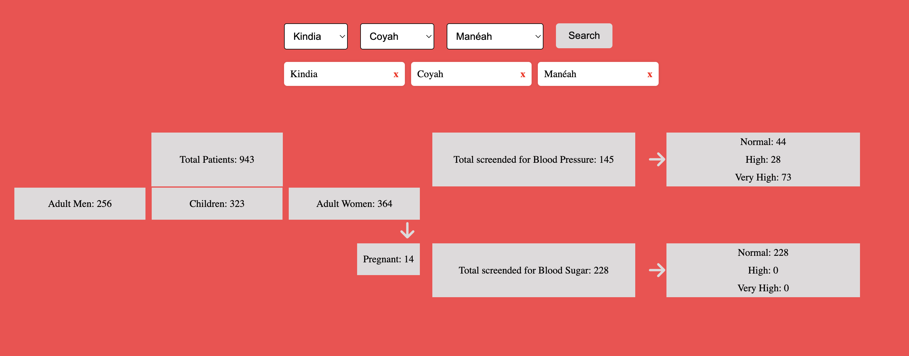

# Clinico Assessment Project
Overview
## Repository Description

This repository provides a Docker setup for a Laravel application. It includes the following files:

- `Dockerfile`: Defines the PHP-FPM environment for Laravel.
- `docker-compose.yml`: Configures the Docker services, including Laravel, MySQL, Nginx, and Adminer.
- `entry-point.sh`: A script that runs database migrations and seeds before starting PHP-FPM.

## Prerequisites

Before getting started, make sure you have the following installed:

- Docker
- Docker Compose

## Setup

Follow these steps to set up the project:

1. Clone the repository:

    ```bash
    git clone https://github.com/ousmane12/test-clinico-ousmane.git
    cd test-clinico-ousmane
    ```

2. Configure Environment Variables:

    Create a `.env` file in the root directory of your Laravel application with the following content:

    ```env
    DB_CONNECTION=mysql
    DB_HOST=mysql
    DB_PORT=3306
    DB_DATABASE=assessmentDB
    DB_USERNAME=root
    DB_PASSWORD=root
    ```

3. Build and Start the Containers:

    Use Docker Compose to build and start the containers:

    ```bash
    docker-compose up --build
    ```

    This command will:

    - Build the Docker images.
    - Start the services defined in the `docker-compose.yml` file.
    - Run the `entry-point.sh` script to apply migrations and seed the database.

## entry-point.sh

The `entry-point.sh` script performs the following actions:

- Run Migrations: Applies any pending migrations to the database.

  ```bash
  php artisan migrate --force
  ```

- Seed the Database: Seeds the database with initial data.

  ```bash
  php artisan db:seed --force
  ```

- Start PHP-FPM: Launches the PHP FastCGI Process Manager.

  ```bash
  php-fpm
  ```

## Accessing the Application

- Web Application: Open your browser and navigate to [http://localhost:8001](http://localhost:8001) to access the Laravel application.
- Database Administration: Open [http://localhost:8080](http://localhost:8080) to use Adminer for managing the MySQL database.

## Stopping the Containers

To stop the running containers, use the following command:

```bash
docker-compose down
```

This command will stop and remove the containers, but it will not remove the associated volumes.

## Troubleshooting

- Database Connection Issues: Ensure that the MySQL container is running and accessible. Check that the environment variables in the `.env` file are correctly set.

- Migration Errors: If migrations fail, check the error messages for details and ensure the database schema matches your migrations.

## Testing

To run the tests for your Laravel application, use the following command:

```bash
php artisan test
```

This command will execute all the tests defined in the application and provide you with the test results, but make sure your containers are running.

## Continuous Integration with GitHub Actions

This project utilizes GitHub Actions for Continuous Integration (CI) to automate testing and ensure code quality. The CI workflow is configured to run tests automatically on each push and pull request to the master branch.

### Workflow Overview

The GitHub Actions workflow is defined in the `.github/workflows` directory of this repository. The primary workflow file is `laravel.yml`, which performs the following tasks:

1. Setup Environment:
    - Uses `shivammathur/setup-php` to install PHP.
    - Configures MySQL service for database tests.

2. Install Dependencies:
    - Runs `composer install` to install PHP dependencies.

3. Prepare Environment:
    - Copies the `.env` file if it does not exist.
    - Generates the application key using `php artisan key:generate`.
    - Sets directory permissions for storage and bootstrap/cache.

4. Run Migrations:
    - Executes database migrations with `php artisan migrate --force`.

5. Run Tests:
    - Runs the tests with `php artisan test`.

### How to Run the Workflow Locally

While GitHub Actions runs the workflow automatically, you can manually run the workflow locally for testing and debugging purposes. To do this:

1. Install GitHub CLI:
    - Ensure you have GitHub CLI installed. You can download it from [GitHub CLI](https://cli.github.com).

2. Trigger the Workflow:
    - Use the GitHub CLI to trigger the workflow manually. Run the following command:
      ```bash
      gh workflow run laravel.yml
      ```

3. Check Workflow Status:
    - You can check the status of the workflow runs with:
      ```bash
      gh run list
      ```

## Screenshot

